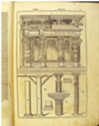

# History of Civil Engineering

It is difficult to determine the history of emergence and beginning of civil engineering, however, that the history of civil engineering is a mirror of the history of human beings on this earth. Man used the old shelter caves to protect themselves of weather and harsh environment, and used a tree trunk to cross the river, which being the demonstration of ancient age civil engineering.

Civil Engineering has been an aspect of life since the beginnings of human existence. The earliest practices of Civil engineering may have commenced between 4000 and 2000 BC in Ancient Egypt and Mesopotamia (Ancient Iraq) when humans started to abandon a nomadic existence, thus causing a need for the construction of shelter. During this time, transportation became increasingly important leading to the development of the wheel and sailing.  

Until modern times there was no clear distinction between civil engineering and architecture, and the term engineer and architect were mainly geographical variations referring to the same person, often used interchangeably. The construction of Pyramids in Egypt (circa 2700-2500 BC) might be considered the first instances of large structure constructions.  

Around 2550 BC, Imhotep, the first documented engineer, built a famous stepped pyramid for King Djoser located at Saqqara Necropolis. With simple tools and mathematics he created a monument that stands to this day. His greatest contribution to engineering was his discovery of the art of building with shaped stones. Those who followed him carried engineering to remarkable heights using skill and imagination.  

Ancient historic civil engineering constructions include the Qanat water management system (the oldest older than 3000 years and longer than 71 km,) the Parthenon by Iktinos in Ancient Greece (447-438 BC), the Appian Way by Roman engineers (c. 312 BC), the Great Wall of China by General Meng T’ien under orders from Ch’in Emperor Shih Huang Ti (c. 220 BC) and the stupas constructed in ancient Sri Lanka like the Jetavanaramaya and the extensive irrigation works in Anuradhapura. The Romans developed civil structures throughout their empire, including especially aqueducts, insulae, harbours, bridges, dams and roads.

Other remarkable historical structures are Sennacherib's Aqueduct at Jerwan built in 691 BC; Li Ping's irrigation projects in China (around 220 BC); Julius Caesar's Bridge over the Rhine River built in 55 BC, numerous bridges built by other Romans in and around Rome(e.g. the pons Fabricius); Pont du Gard (Roman Aqueduct, Nimes, France) built in 19 BC; the extensive system of highways the Romans built to facilitate trading and (more importantly) fast manoeuvring of legions; extensive irrigation system constructed by the Hohokam Indians, Salt River, AZ around 600 AD; first dykes defending against high water in Friesland, The Netherlands around 1000 AD; El Camino Real - The Royal Road, Eastern Branch, TX and Western Branch, NM (1500s AD).  

Machu Picchu, Peru, built at around 1450, at the height of the Inca Empire is considered an engineering marvel. It was built in the Andes Mountains assisted by some of history’s most ingenious water resource engineers. The people of Machu Picchu built a mountain top city with running water, drainage systems, food production and stone structures so advanced that they endured for over 500 years.  

A treatise on Architecture, Book called Vitruvius' De Architectura, was published at 1AD in Rome and survived to give us a look at engineering education in ancient times. It was probably written around 15 BC by the Roman architect Vitruvius and dedicated to his patron, the emperor Caesar Augustus, as a guide for building projects.  

Throughout ancient and medieval history most architectural design and construction was carried out by artisans, such as stonemasons and carpenters, rising to the role of master builder. Knowledge was retained in guilds and seldom supplanted by advances. Structures, roads and infrastructure that existed were repetitive, and increases in scale were incremental.  

One of the earliest examples of a scientific approach to physical and mathematical problems applicable to civil engineering is the work of Archimedes in the 3rd century BC, including Archimedes Principle, which underpins our understanding of buoyancy, and practical solutions such as Archimedes’ screw. Brahmagupta, an Indian mathematician, used arithmetic in the 7th century AD, based on Hindu-Arabic numerals, for excavation (volume) computations.  

## Educational & Institutional history of civil engineering

In the 18th century, the term civil engineering was coined to incorporate all things civilian as opposed to military engineering. The first engineering school, The National School of Bridges and Highways, France, was opened in 1747. The first self-proclaimed civil engineer was John Smeaton who constructed the Eddystone Lighthouse. In 1771, Smeaton and some of his colleagues formed the Smeatonian Society of Civil Engineers, a group of leaders of the profession who met informally over dinner. Though there was evidence of some technical meetings, it was little more than a social society.   

In 1818, world’s first engineering society, the Institution of Civil Engineers was founded in London, and in 1820 the eminent engineer Thomas Telford became its first president. The institution received a Royal Charter in 1828, formally recognizing civil engineering as a profession.   

Its charter defined civil engineering as:  

_“Civil engineering is the application of physical and scientific principles, and its history is intricately linked to advances in understanding of physics and mathematics throughout history. Because civil engineering is a wide ranging profession, including several separate specialized sub-disciplines, its history is linked to knowledge of structures, material science, geography, geology, soil, hydrology, environment, mechanics and other fields.”_  

The first private college to teach Civil Engineering in the United States was Norwich University founded in 1819 by Captain Alden Partridge. The first degree in Civil Engineering in the United States was awarded by Rensselaer Polytechnic Institute in 1835. The first such degree to be awarded to a woman was granted by Cornell University to Nora Stanton Blatch in 1905.
